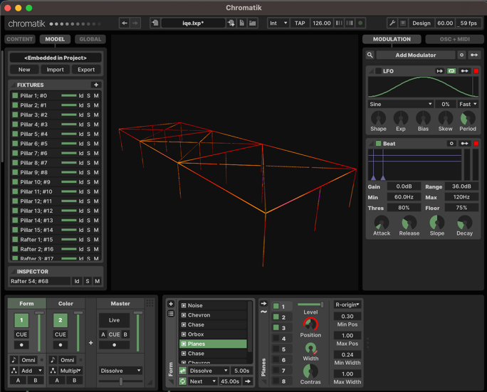

# In Queso Emergency

# Playa 2024 - To Do
- Confirm and notate PixLite outputs connection strategy
    - 1 side outputs #1 - #12, other #17 - #28
    - Nick believes 12 data cables on one side, 12 on other
    - Can see in line 27/28 of [buildProject.js](./src/nodejs/buildProject.js) code that it looks like we
      set up the manual ArtNet mappings for the two halves of 12 rows of strips, and the second half fourth output
      needed some kind of semi wonky jump... or maybe we went to another output (one after would be last, so #29)???

# Summary
Mainly LX Studio / Chromatik project and Java code for Burning Man IQE HQ shade structure LEDznutz.

Also contains python code and Jupyter notebooks for audio analysis with
[Librosa](https://librosa.org/doc/latest/index.html),
e.g. real time beat detection and sync.

Plus Node.JS OSC backed web app control system.

Outdated screenshart:


# Use

Prerequisites:

1. Make sure `git-lfs` (Large File Storage) is already installed, e.g. `brew install git-lfs`
1. Java 17 Temurin / Eclipse is installed from here: https://adoptium.net/

Then find and double-click the `IQE.command` here in this repo / folder. (Note: until annoying-ass Maven is sorted,
before very first `./mvnw` CLI use, need to have clicked above or run its scripts).

You can import this repo as project (select pom.xml) in IntelliJ IDEA, and just click the dropdown near Play and Debug
buttons to select ready-to-go easy run configuration, ready to run (or debug, with hot reload, useful!) via those buttons.

Or examples with sperminal:

```bash
./src/scripts/download_chromatik.sh # do once, to fetch LX / Chromatik per arch binary jar
./mvnw clean package -DskipTests ; # to (re-)build

# and run
eval "java $( [[ $(uname) == 'Darwin' ]] && echo '-XstartOnFirstThread' ) \
    -cp ./target/iqe-1.0-SNAPSHOT-jar-with-dependencies.jar:./vendor/glxstudio.jar \
    heronarts.lx.studio.ChromatikIQE iqe.lxp"
```

# PixelBlaze Pattern Support

Some PixelBlaze functionality has been ported (with permission). Currently there is a `PixelBlazeBlowser` pattern with
a `script` knob. Changing it will cycle some PB patterns, some with controls / sliders, and not all render.

Much of this is twerk-in-brogress and needs vetting for what is potentially useful. As with a lot of the code
and intent here, it would be great if we could get more "stock" / crowd-sourced patterns working given time constraints.

# Controls / Web

TODO: polish these docs and notes (more).
TODO: refactor all my node + OSC ideas to separate, licensed, NDA [🥴] lib

There is a Node.JS app in [./src/nodejs](./src/nodejs).
It's able to control LX via OSC, from any device (e.g. mobile phone
connected to Playa RaspberryPi ad hoc wifi network ...damn, cool right?).

Instructions:

```bash
cd ./src/nodejs # change dir to nodejs web app dir

# do once-ish:
nvm use # requires (the great) nvm installed (node version manager)
npm install # standard... as much as Node has standards, amirite?

# Now run, first starting nodeJs bridge + web app
npm start
```

Next start / open LX / Chromatik (TODO: shouldn't need this ordering) ...

Now load web UI at this URL in blowser, either on craptop
(or scan camp QR code on camp wifi and control with
phone / any device / we're such a fun camp!!!!):

[http://localhost:8181](http://localhost:8181)

Moving knobs in LX renders webapp controls moving + feedback.
And, ofc, moving web UI controls, controls LX.
(Look at "Knobs" in global Modulator section in LX as [early] example).

Lots of potentch + power here (e.g. custom/admin controls,
party mode, Orchestrator buttons / actions)...

# Project File

We can (of course) make edits to the project in LX Studio / Chromatik, and save it
to persist these changes.

Rarely to never, one can (of course) edit the [iqe.lxp](./iqe.lxp) JSON directly.

There is a NodeJS script that will parse the `.lxp` JSON, and rebuild only the fixtures part,
and re-write the `.lxp` file with it. Put another way, we generate and update the fixture geometry via simple
script. Run it via:

```bash
(cd ./src/nodejs ; npm run lxp )
```

# Audio analysis

The [audio-tooling](./src/audio-tooling/) directory here contains python code, and experiments
with real time audio analysis (like beat detection and sync).

You can easily run the Jupyter notebooks as long as you have [Docker](https://www.docker.com/) installed,

```bash
cd src/audio-tooling/jupyter
docker-compose up
```

And visit [localhost:8888](http://localhost:8888) for locally running Jupyter Labs notebook UI.
(Or point an IDE (like
[VS Code](https://code.visualstudio.com/docs/datascience/jupyter-notebooks#_connect-to-a-remote-jupyter-server), tested)
to Jupyter server and python kernel with URL: `http://localhost:8889?token=a`).

Re-export notebooks:

```bash
docker-compose exec -it jupyter-lab jupyter nbconvert --to html --output-dir /out '*.ipynb'
```

TODO: Look into SuperCollider https://depts.washington.edu/dxscdoc/Help/Classes/BeatTrack.html , as well as if
MaxMSP can run on Pi, and BeatSeeker Ableton M4L can run? (Although is this only for drums, not full track?)
https://www.ableton.com/en/packs/beatseeker/

# PixelBlaze / Python

```bash
conda create -n iqe python=3.11
conda activate iqe
brew install portaudio
pip install -r ~/src/iqe/requirements.txt
pip install -r ~/src/Flamecaster/requirements.txt
(cd ~/src/marimapper ; pip install -e . )
```

For wifi access point mode, hold button when turning on, until flashes. Join network, go to config page:
http://192.168.4.1
Then point to camp wifi and store IP address. (Probably better ways to scan).

## Marimapper Automapping

Upload "marimapper" pattern in this repo manually (wish there were API for this?).
See more examples in my marimapper fork.

Conda example:
```bash
conda create -n marimapper python=3.11
conda activate marimapper
# Commands run local code edits
pip install -e .
```

TODO(jmarnell) - figure out where to put stuff

```bash
pip install "marimapper[pixelblaze]" @ git+http://github.com/themariday/marimapper"
```

Add doc manual step of uploading .epe, API looks hard unfortch Install and set up Camo, pair iPhone. Deselect annoying watermark. Make sure high framerate?

todo: i think i saw a name match example somewhere...

```bash
# maybe need this multiple times
pip install -e .
DEBUG_LOGGING=True marimapper_check_camera --device 0
DEBUG_LOGGING=True marimapper --device 0 --backend pixelblaze --server 192.168.0.95 ~/src/iqe/src/main/resources/binger-bag
marimapper_upload_to_pixelblaze --server 192.168.0.95 --csv_file $(find ~/src/iqe/src/main/resources/binger-bag -type f | sort | tail -n1)
```

Add Q quit button

Sigh, I had to futz with Camo a lot, change watermark in and out maybe?

Hacked Electight pebble strip are `GRB` I think, also switch it to ws2812 / NeoPixel!
BTF are `RGB`

```bash
python src/scripts/flamecaster_conf.py > src/main/resources/flamecaster-config.conf
```

## ArtNet Debug

jesus fucking christ what a god awful fucking nightmare.

I think pixel counts and universe numbers must be absolutely exact and expected between
Pixelblaze config, flamecastur config, and LX fixtures. Nightmare.

Finally got a testcase of two pixelblazes emulating corner configs. 200 pebbles on one,
400+ eco strip pixels (PB set to 400, OF COURSE THOUGH!). ArtNet port doesn't seem to
work with LX, tried two mutual Flamecasturbaishtion but could never get it to the other.

*** RE-START / RE-SELECT PIXELBLAZE PATTERNS!!!!!!!

```bash
# upload these
ls src/main/resources/artNetDebug.NECorner.200BTFPebbles.pbb # @ ip 192.168.0.79
ls src/main/resources/artNetDebug.NWCorner.400BTFecostrip.pbb # @ ip 192.168.0.229
(cd ~/src/Flamecaster ; python Flamecaster.py --file ~/src/iqe/src/main/resources/artNetDebug.flamecaster.json)

java -XstartOnFirstThread -cp ./target/iqe-1.0-SNAPSHOT-jar-with-dependencies.jar:./vendor/glxstudio.jar heronarts.lx.studio.ChromatikIQE fartNetTestes_manyUniverseTestes.lxp
```

******* Next thing to try, overwrite the dumb fucking Java class Object #89123 Fixtures to be able
to set override the port (in buildOutputs() ?) and try flamecasturbaishe again. ~DONE~

Tried many universe approach again, no logging in flamecaster, no action:
```bash
(cd ~/src/Flamecaster ; python Flamecaster.py --file ~/src/iqe/src/main/resources/artNetDebug_manyUniverseTestes.flamecaster.json)
./mvnw package -DskipTests ; java -XstartOnFirstThread -cp ./target/iqe-1.0-SNAPSHOT-jar-with-dependencies.jar:./vendor/glxstudio.jar heronarts.lx.studio.ChromatikIQE fartNetTestes_manyUniverseTestes.lxp
```

Trying another port. SUCCESS!!!! With 0 based artNet universe counting, and alternate artNet port,
hacked into LX so it (fucking) honors it, this is clashless PoC (Advatek stays on its standard port 🤞🏻, won't know till Playa. Great.)
```bash
(cd ~/src/Flamecaster ; python Flamecaster.py --file ~/src/iqe/src/main/resources/artNetDebug.port.flamecaster.json)
./mvnw package -DskipTests ; java -XstartOnFirstThread -cp ./target/iqe-1.0-SNAPSHOT-jar-with-dependencies.jar:./vendor/glxstudio.jar heronarts.lx.studio.ChromatikIQE fartNetTestes_port.lxp
```

Next, we programmatically build Strips + Flamecasturbator configglesmiths for alternate port and universe striping.

First striping attempt failed. What about many low index numbered universes, only ten pixels in each... then I
shouldn't have to worry about channels at least. Could also in process try not filling a device, thus
take existing fixtures and shrink them. Right now there is 2 for PB 1 and 3 for PB2. Let's try 3 and 2, all ten size...

I think this works!
```bash

```

# Special Thanks

Big thank you to kind souls, especially of Titanic's End, Pixelblaze, SymmetryLabs, who've helped us!

- [Mark Slee](https://heronarts.com/)
- [Ben Hencke](https://www.bhencke.com/)
- [Jeff Vyduna](https://ngnr.org/)
- [Justin K Belcher](https://www.instagram.com/jkb_studio)
