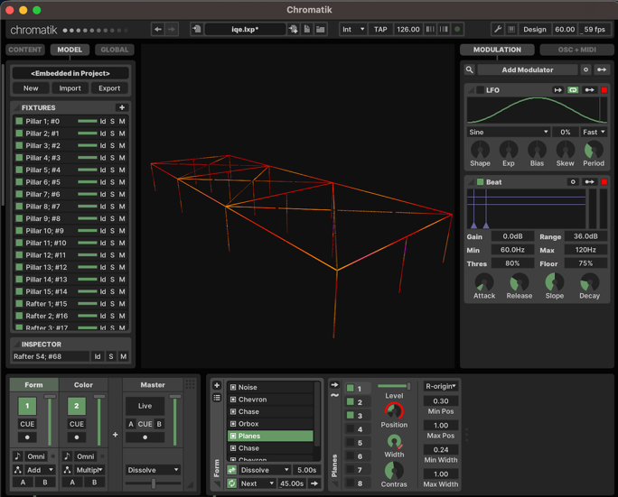

# In Queso Emergency

Mainly LX Studio / Chromatik project and Java code for Burning Man IQE HQ shade structure LEDznutz.
Also contains python code and Jupyter notebooks for audio analysis with Librosa,
e.g. real time beat detection and sync.



# Use

Prereqs:
1. Chromatik alpha build zip is downloaded and unzipped to your `~/Downloads` folder in your user Home folder.
2. Java 17 Temurin / Eclipse is installed from here: https://adoptium.net/

Then double click this [IQE.command](./IQE.command) in this repo / folder.

You can import this repo as project (select pom.xml) in IntelliJ IDEA, and just click the dropdown near Play and Debug
buttons to select ready-to-go easy run configuration, ready to run (or debug, with hot reload, useful!) via those buttons.

Or example with sperminal:
```bash
./mvnw clean package -DskipTests ; \
java -XstartOnFirstThread \
    -cp $(find target -name '*.jar'):$(\
    find "$HOME/Downloads/Chromatik-alpha/" -name 'glxstudio*.jar') \
    heronarts.lx.studio.Chromatik iqe.lxp \
    --classpath-plugin org.iqe.LXPluginIQE
```

# Audio analysis

The [audio-tooling](./audio-tooling/) directory here contains python code, and experiments
with real time audio analysis (like beat detection and sync).

You can easily run the Jupyter notebooks as long as you have [Docker](https://www.docker.com/) installed,
```bash
cd audio-tooling/jupyter
docker-compose up
```
And visit [localhost:8888](http://localhost:8888) for locally running Jupyter Labs notebook UI.
(Or point an IDE (like
[VS Code](https://code.visualstudio.com/docs/datascience/jupyter-notebooks#_connect-to-a-remote-jupyter-server), tested)
to Jupyter server and python kernel with URL: `http://localhost:8889?token=a`).
