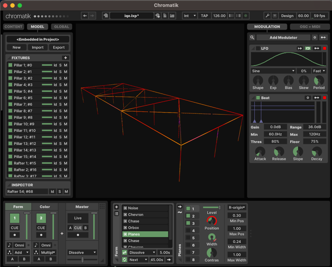

# In Queso Emergency

# Playa 2024 - To Do
- Confirm and notate PixLite outputs connection strategy
    - 1 side outputs #1 - #12, other #17 - #28
    - Nick believes 12 data cables on one side, 12 on other
    - Can see in line 27/28 of [buildProject.js](./src/nodejs/buildProject.js) code that it looks like we
      set up the manual ArtNet mappings for the two halves of 12 rows of strips, and the second half fourth output
      needed some kind of semi wonky jump... or maybe we went to another output (one after would be last, so #29)???

# Summary
Mainly LX Studio / Chromatik project and Java code for Burning Man IQE HQ shade structure LEDznutz.
See more pics: (https://johnnymarnell.github.io/led-art)[https://johnnymarnell.github.io/led-art]

Also contains python code and Jupyter notebooks for audio analysis with
[Librosa](https://librosa.org/doc/latest/index.html),
e.g. real time beat detection and sync.

Plus Node.JS OSC backed web app control system.

**2026-09 note:** there is now a root [`justfile`](./justfile) with a recipe for every
way to run things (`just` to list), and a `docs/` folder: [`docs/RUNNING.md`](./docs/RUNNING.md)
(every subsystem, ports, env setup, what's broken), [`docs/DMX-PARCANS.md`](./docs/DMX-PARCANS.md),
[`docs/TOUCHDESIGNER.md`](./docs/TOUCHDESIGNER.md), [`docs/PIXELBLAZE-EMULATOR-LX.md`](./docs/PIXELBLAZE-EMULATOR-LX.md).
Where this README and those disagree, the docs are newer.

Outdated screenshart:


# Use

Prerequisites:

1. Clone this repository to a folder (you can use GitHub Desktop App if this is new to you)
1. Java 17 "Temurin / Eclipse" is installed from here: https://adoptium.net/ (tied to our old LX / Chromatik build)

Then find and double-click the `IQE.command` here in this repo / folder in Finder.

You can import this repo as project (select pom.xml) in IntelliJ IDEA, and just click the dropdown near Play and Debug
buttons to select ready-to-go easy run configuration, ready to run (or debug, with hot reload, useful!) via those buttons.

Or examples with sperminal:

```bash
./mvnw clean package -DskipTests ; # to (re-)build

./RUN.sh # should quickly build and run, same as Mac 

# the java command these execute:
eval "java $( [[ $(uname) == 'Darwin' ]] && echo '-XstartOnFirstThread' ) \
    -cp ./target/iqe-1.0-SNAPSHOT-jar-with-dependencies.jar:./vendor/glxstudio.jar \
    heronarts.lx.studio.ChromatikIQE iqe.lxp"
```

Or with [just](https://github.com/casey/just): `just build && just lx` (see `just --list`).

Note we are on an old version of Chromatik / LX Studio (0.4.2-SNAPSHOT alpha from 2023-07 in
`vendor/glxstudio.jar`), haven't properly upgraded and bootstrapped yet. The main class
`heronarts.lx.studio.ChromatikIQE` only exists inside that jar now (`just lx-main-src` prints the
last committed source).

**Gotcha:** the 72 ceiling strips in `Projects/iqe.lxp` point at hostname `advatek-local`, which
`/etc/hosts` on the laptop maps to `127.0.0.1` (the ArtNet simulator). To drive the real PixLite
either change that hosts entry or run `just lxp-strip-host advatek` (10.10.42.80). `just hosts` shows
the aliases; `just lxp-fixtures` shows what the project currently points at.

# PixelBlaze Pattern Support

Some PixelBlaze functionality has been ported (with permission). Currently there is a `PixelBlazeBlowser` pattern with
a `script` knob. Changing it will cycle some PB patterns, some with controls / sliders, and not all render.

Much of this is twerk-in-brogress and needs vetting for what is potentially useful. As with a lot of the code
and intent here, it would be great if we could get more "stock" / crowd-sourced patterns working given time constraints.

# Controls / Web

TODO: polish these docs and notes (more).
TODO: refactor all my node + OSC ideas to separate, licensed, NDA [🥴] lib

There are two web control apps; the TypeScript one is the current one.

**Current: [./src/control-ui](./src/control-ui)** (TypeScript, Vite, 2025). Speed slider, transition /
color / hold buttons, solo, pong paddles, parcan toggle, Mindshow. Browser → WebSocket :8080 →
OSC UDP :3232 into the IQE plugin's `OscBridge` (LX replies on :3333).

```bash
just control        # Vite dev server on http://localhost:8282 (LAN-exposed) + the OSC bridge
just control-prod   # build dist/ and serve it from the unified server on :8282
# or: cd src/control-ui && npm install && npm run control
```

Note: plain `npm start` in control-ui is **bridge-only** since Dec 2025 (no web page unless
`NODE_ENV=production`). `start-control.sh` and `SPEED_CONTROL_README.md` predate that.

**Legacy: [./src/nodejs](./src/nodejs)** (2023, jQuery + Tailwind, the "IQE LED Command Staishe" page
with the XY pad and Knobs). It's able to control LX via OSC, from any device (e.g. mobile phone
connected to Playa RaspberryPi ad hoc wifi network ...damn, cool right?). Its own `npm start` binds
port **80** (needs root); use the recipe for 8181:

```bash
just legacy-web     # http://localhost:8181, OSC 3232/3333, WS 8080
```

Don't run it at the same time as control-ui (both bind WS 8080 and UDP 3333). Its channel-index
buttons (channel 1 "Form", 2 "Color") target 2023 channel indices and are stale. The committed
`dist/osc-js` symlink dangles under npm workspaces, so the page may 404 on `osc.min.js`.

Moving knobs in LX renders webapp controls moving + feedback.
And, ofc, moving web UI controls, controls LX.
(Look at "Knobs" in global Modulator section in LX as [early] example).

No Node at all: `just osc /lx/mixer/master/effect/1/speed 0.5` sends a raw OSC packet to LX,
`just osc-sniff` prints everything LX emits.

Lots of potentch + power here (e.g. custom/admin controls,
party mode, Orchestrator buttons / actions)...

# Project File

We can (of course) make edits to the project in LX Studio / Chromatik, and save it
to persist these changes.

Rarely to never, one can (of course) edit the [iqe.lxp](./Projects/iqe.lxp) JSON directly.

There is a NodeJS script that will parse the `.lxp` JSON, and rebuild only the fixtures part,
and re-write the `.lxp` file with it. Put another way, we generate and update the fixture geometry via simple
script. Run it via:

```bash
(cd ./src/nodejs ; npm run lxp )   # or: just lxp-regen
```

Caveats (2026-09): it overwrites `Projects/iqe.lxp` **in place** (quit LX first), resets the strip
host to `10.10.42.80` (the file currently uses `advatek-local`), re-adds 32 Flamecaster netStrips
(the file has 31), and discards per-fixture edits made in the Chromatik UI. Par can fixtures are
preserved. The 8 par cans are regenerated separately by `parcan-surgery.ts` (`just parcan-surgery`,
writes `Projects/iqe_modified.lxp`). See [`docs/DMX-PARCANS.md`](./docs/DMX-PARCANS.md).

# Audio analysis

The [audio-tooling](./src/audio-tooling/) directory here contains python code, and experiments
with real time audio analysis (like beat detection and sync).

You can easily run the Jupyter notebooks as long as you have [Docker](https://www.docker.com/) installed,

```bash
cd src/audio-tooling/jupyter
docker compose up          # (v2 syntax; Docker Desktop is currently uninstalled on the laptop)
```

And visit [localhost:8888](http://localhost:8888) for locally running Jupyter Labs notebook UI.
(Or point an IDE (like
[VS Code](https://code.visualstudio.com/docs/datascience/jupyter-notebooks#_connect-to-a-remote-jupyter-server), tested)
to Jupyter server and python kernel with URL: `http://localhost:8889?token=a`).

Re-export notebooks:

```bash
docker compose exec -it jupyter-lab jupyter nbconvert --to html --output-dir /out '*.ipynb'
```

The real-time tool that came out of the notebook is `src/audio-tooling/beat_detective.py`: PyAudio on a
loopback device (BlackHole), librosa beat tracking, OSC `/lx/tempo/beat|bpm|clockSource` to LX on UDP 3232.

```bash
just venv && just venv-audio          # once (uv venv on Python 3.10, brew portaudio)
just beat                             # -i "BlackHole 2ch" -o "Speakers"; LX must be running
```

TODO: Look into SuperCollider https://depts.washington.edu/dxscdoc/Help/Classes/BeatTrack.html , as well as if
MaxMSP can run on Pi, and BeatSeeker Ableton M4L can run? (Although is this only for drums, not full track?)
https://www.ableton.com/en/packs/beatseeker/

# PixelBlaze / Python

The conda story below is what was written in 2024; what actually existed last was a **uv** venv on
Python 3.10 at `./.venv` (now dead, its base interpreter was uninstalled). `requirements.txt` was
overwritten in Aug 2025 with the PixelBlaze-monitor deps and no longer lists the audio stack
(`src/audio-tooling/old.requirements.txt` is the pinned set that worked). Rebuild with:

```bash
just venv               # uv venv --python 3.10 + requirements.txt + click
just venv-audio         # brew portaudio + pyaudio/librosa/python-osc
just venv-flamecaster   # ~/src/Flamecaster/requirements.txt
just venv-all           # everything incl. opencv (video tools) and matplotlib (simulator)
```

Old instructions, for reference:

```bash
conda create -n iqe python=3.11
conda activate iqe
brew install portaudio
pip install -r ~/src/iqe/requirements.txt
pip install -r ~/src/Flamecaster/requirements.txt
(cd ~/src/marimapper ; pip install -e . )   # no marimapper checkout exists on the laptop any more
```

For wifi access point mode, hold button when turning on, until flashes. Join network, go to config page:
http://192.168.4.1
Then point to camp wifi and store IP address. (Probably better ways to scan: `just pb-scan`,
`just pb-connect`, `just pb-flash <ssid>` wrap `src/pixelblaze/pb.py`; read `NETWORKING-NOTES.md`
first, macOS Internet Sharing will eat your internet.)

Fleet monitor (Flask, http://localhost:8000): `just pb-monitor`. See `PIXELBLAZE_FLEET.md`.

## Marimapper Automapping

(2026-09: `~/src/marimapper` is gone from the laptop — `~/src/wtf` is a dangling symlink to it. The
successor is `~/src/led-map`, a native iOS capture + reconstruction app with its own justfile. The
notes below are kept for the PB pattern and CSV format, which are still in `src/main/resources/`.)

Upload "marimapper" pattern in this repo manually (wish there were API for this?).
See more examples in my marimapper fork.

Conda example:
```bash
conda create -n marimapper python=3.11
conda activate marimapper
# Commands run local code edits
pip install -e .
```

TODO(jmarnell) - figure out where to put stuff

```bash
pip install "marimapper[pixelblaze] @ git+https://github.com/themariday/marimapper"
```

Add doc manual step of uploading .epe, API looks hard unfortch Install and set up Camo, pair iPhone. Deselect annoying watermark. Make sure high framerate?

todo: i think i saw a name match example somewhere...

```bash
# maybe need this multiple times
pip install -e .
DEBUG_LOGGING=True marimapper_check_camera --device 0
DEBUG_LOGGING=True marimapper --device 0 --backend pixelblaze --server 192.168.0.95 ~/src/iqe/src/main/resources/binger-bag
marimapper_upload_to_pixelblaze --server 192.168.0.95 --csv_file $(find ~/src/iqe/src/main/resources/binger-bag -type f | sort | tail -n1)
```

Add Q quit button

Sigh, I had to futz with Camo a lot, change watermark in and out maybe?

Hacked Electight pebble strip are `GRB` I think, also switch it to ws2812 / NeoPixel!
BTF are `RGB`

```bash
# make sure PixelBlazes have ArtNet pattern running
python src/scripts/flamecaster_conf.py "192.168.0.79 192.168.0.229" "400 400" > src/main/resources/flamecaster.json
# or: just flamecaster-conf "192.168.0.79 192.168.0.229" "400 400"

(cd ~/src/Flamecaster ; python Flamecaster.py --file ~/src/iqe/src/main/resources/flamecaster.json)
# or: just flamecaster
```

Note `RUN.sh` launches Flamecaster with `flamecaster-config.conf`, a file that only ever existed on the
`playa2024` branch; on master that background step just fails. `flamecaster.json` is the right file.

Random note I think binaries dir here was upgrade we never got to try

## ArtNet Debug

jesus fucking christ what a god awful fucking nightmare.

I think pixel counts and universe numbers must be absolutely exact and expected between
Pixelblaze config, flamecastur config, and LX fixtures. Nightmare.

Finally got a testcase of two pixelblazes emulating corner configs. 200 pebbles on one,
400+ eco strip pixels (PB set to 400, OF COURSE THOUGH!). ArtNet port doesn't seem to
work with LX, tried two mutual Flamecasturbaishtion but could never get it to the other.

*** RE-START / RE-SELECT PIXELBLAZE PATTERNS!!!!!!!

```bash
# upload these
ls src/main/resources/artNetDebug.NECorner.200BTFPebbles.pbb # @ ip 192.168.0.79
ls src/main/resources/artNetDebug.NWCorner.400BTFStrip.pbb # @ ip 192.168.0.229
(cd ~/src/Flamecaster ; python Flamecaster.py --file ~/src/iqe/src/main/resources/artNetDebug.flamecaster.json)

java -XstartOnFirstThread -cp ./target/iqe-1.0-SNAPSHOT-jar-with-dependencies.jar:./vendor/glxstudio.jar heronarts.lx.studio.ChromatikIQE fartNetTestes_manyUniverseTestes.lxp
```

******* Next thing to try, overwrite the dumb fucking Java class Object #89123 Fixtures to be able
to set override the port (in buildOutputs() ?) and try flamecasturbaishe again. ~DONE~

Tried many universe approach again, no logging in flamecaster, no action:
```bash
(cd ~/src/Flamecaster ; python Flamecaster.py --file ~/src/iqe/src/main/resources/artNetDebug_manyUniverseTestes.flamecaster.json)
./mvnw package -DskipTests ; java -XstartOnFirstThread -cp ./target/iqe-1.0-SNAPSHOT-jar-with-dependencies.jar:./vendor/glxstudio.jar heronarts.lx.studio.ChromatikIQE fartNetTestes_manyUniverseTestes.lxp
```

Trying another port. SUCCESS!!!! With 0 based artNet universe counting, and alternate artNet port,
hacked into LX so it (fucking) honors it, this is clashless PoC (Advatek stays on its standard port 🤞🏻, won't know till Playa. Great.)
```bash
(cd ~/src/Flamecaster ; python Flamecaster.py --file ~/src/iqe/src/main/resources/artNetDebug.port.flamecaster.json)
./mvnw package -DskipTests ; java -XstartOnFirstThread -cp ./target/iqe-1.0-SNAPSHOT-jar-with-dependencies.jar:./vendor/glxstudio.jar heronarts.lx.studio.ChromatikIQE fartNetTestes_port.lxp
```

Next, we programmatically build Strips + Flamecasturbator configglesmiths for alternate port and universe striping.

First striping attempt failed. What about many low index numbered universes, only ten pixels in each... then I
shouldn't have to worry about channels at least. Could also in process try not filling a device, thus
take existing fixtures and shrink them. Right now there is 2 for PB 1 and 3 for PB2. Let's try 3 and 2, all ten size...

I think this works!
```bash
(cd ~/src/Flamecaster ; python Flamecaster.py --file ~/src/iqe/src/main/resources/artNetDebug.tens.flamecaster.json)
./mvnw package -DskipTests ; java -XstartOnFirstThread -cp ./target/iqe-1.0-SNAPSHOT-jar-with-dependencies.jar:./vendor/glxstudio.jar heronarts.lx.studio.ChromatikIQE fartNetTestes_tens.lxp
```

So in this universe (_HAhaHahahahAHHAHAHhahahaHAHA_), java fixtures can just keep incrementing in 10-sized universes,
and the python generated config just needs to switch over.
```bash
python src/scripts/flamecaster_conf.py "<ip1> <ip2>" "<px1> <px2>" > src/main/resources/artNetDebug.tens.flamecaster.json
python src/scripts/flamecaster_conf.py "<ip1> <ip2>" "<px1> <px2>" > src/main/resources/flamecaster.json
```

(By the way, thought I could try skipping to a higher universe like 40 [since first 0-39 would be curtain one], confirmed
thought it didn't error, it doesn't work, second PB didn't animate. What a mess!).

I also keep hoping pixel count doesn't matter as much across Flamecaster, real pixelblaze settings, and LX,
but I'm pretty sure I can't guarantee that. So everything needs to be perfect. Start with 30 and 20. Then get
200 and 400. Then build a real 400 and cross fingers. Then build second real 400. Also print configs, as I borked it.

Oh man, don't forget to enable output on fixtures :(

Ended up going nodejs route.

Revisiting Flamecaster + LX.
Made 3 strips, R, G, B of pixels 30, 24, 19 = 73 total pixelblaze pixels to map.
I want 4 universes arbitraly numbered, 1 is contained by PB1, 2 is shared, 3 + 4 are PB2.

Note there are 750 total pixels on disco ball + Gandalf staff eco strip IP6+ with one PixelBlaze testes I did,
quick video: https://www.youtube.com/shorts/jStYmAj-Le8

# Rando Burning Man Desert  Notes, God Help Us All

## Checklist

### Before Playa

- Make sure GitHub Desktop App is logged in
- pull latest to project
- it's located in Finder at Home directory, src, iqe: ~/src/iqe
- Desktop has link to these notes, and link to Run / Start Command
- Verify LX Starts via clicking command

### Important / On Playa
- Connect power and ethernet for pixlite, router, laptop
- Each of these should get IP's of 10.10.42.xx, plus they should be:
  - IQE router: ?? (probably 10.10.42.1 ?)
  - PixLite: 10.10.42.80
  - IQE laptop: ?? (hopefully hostname is "iqe", not even with ".local", for easy connect via device?), maybe it was 10.10.42.42 (btw this would be the *adapter* IP, right?)
  - Swider's Pknight: 10.10.42.68
  - j5 Anker Dongle (often wifi shared), gets link local garbage of 169.254.81.171 , and 192.168.2.X (2.1?) when "bridge100" Mac Internet from WiFi sharing is active (RPi gets similar ;via DHCP)
- If pixLite is not at this IP, every fixture in LX project will have wrong address, need to change everywhere, or, change in ~line 50 of `buildProject.js` 
  here in this repo, and run it in terminal (SAVE CHANGES IN iqe.lxp [MAIN PROJECT] FIRST AND QUIT LX).
  Easier since 2025: the strips use hostname `advatek-local`/`advatek` — edit `/etc/hosts`, or
  `just lxp-strip-host 10.10.42.xx` rewrites the 72 strip hosts without regenerating anything:
- U'King ParCans, recharge-able battery, model: ZQ01104 (or ZQ01047 per `src/dmx/parcan_tester.py` — check a sticker).
  8 of them, 7-channel mode, DMX addresses 1/8/15/22/29/36/43/50, driven from LX via Swider's Pknight
  ArtNet→DMX node at 10.10.42.68 universe 1 — NOT via the PixLite. Full catalog + burn notes:
  [docs/DMX-PARCANS.md](./docs/DMX-PARCANS.md). Kill switch: `just parcans-toggle`.
- In LX geometry, the ceiling is about y=700, if north is looking in from road pointing at shipping containers, then northwest
  corner is about above 0,0,0 origin, X+ is north, Z+ is west. NE corner is about 0, 700, -2000 (z), and SE is -2400, 700, -2000
- So rows are about 10 LX pixels apart and about 2000 long, 2400 x 2000
- Parcans: 4 corners + 4 along the north/road edge (x=60, z=-1580/-1180/-780/-380), all at y=720.
  Kitty corners: -2400, 720, 20 // 60, 720, -1980
- Corners, NE is x max, z min,   NW (CCW) is x max, z max,   SW is x min, z max,   SE is x min, z min
  -            60, 720, -1980,        60, 720, 20,                -2400, 720, 20    -2400, 720, -1980

```bash
node ~/src/iqe/src/nodejs/buildProject.js
```
- can try [http://10.10.42.80](http://10.10.42.80) in browser, hopefully loads PixLite UI. (Try Advatek Assistant as last resort) 

# Links
- [Standford course involving LX Studio](https://code.stanford.edu/plevis/ee185/-/tree/master/software/FlightGui)

# To Do
- Add base pre-requisites, sdkman, maven, java 17 Temurin
- Re-organize this repository (dont use submodule for IDE?), submit PR to LXStudio-IDE with sdkmanrc, improved os + arch inference, for now cd

# Scratch area

Scrape a bunch of test files
```bash
youtube_dl_mp3  'Monolink (live) - Mayan Warrior - Burning Man 2022'  'Keinemusik Mayan Bruning Man'  'ed sheeran bad habits'  'Chill EDM Slow Dance Mix'  'SLOW TRANCE • Downtempo EDM Background Track'  'dua lipa levitating'  "dua don't "  "dua new rules "  "lady gaga poker face " '120 bpm metronome' '126 bpm metronome'
```

# Special Thanks

Big thank you to kind souls, especially of Titanic's End, Pixelblaze, SymmetryLabs, who've helped us!

- [Mark Slee](https://heronarts.com/)
- [Ben Hencke](https://www.bhencke.com/)
- [Jeff Vyduna](https://ngnr.org/)
- [Justin K Belcher](https://www.instagram.com/jkb_studio)
